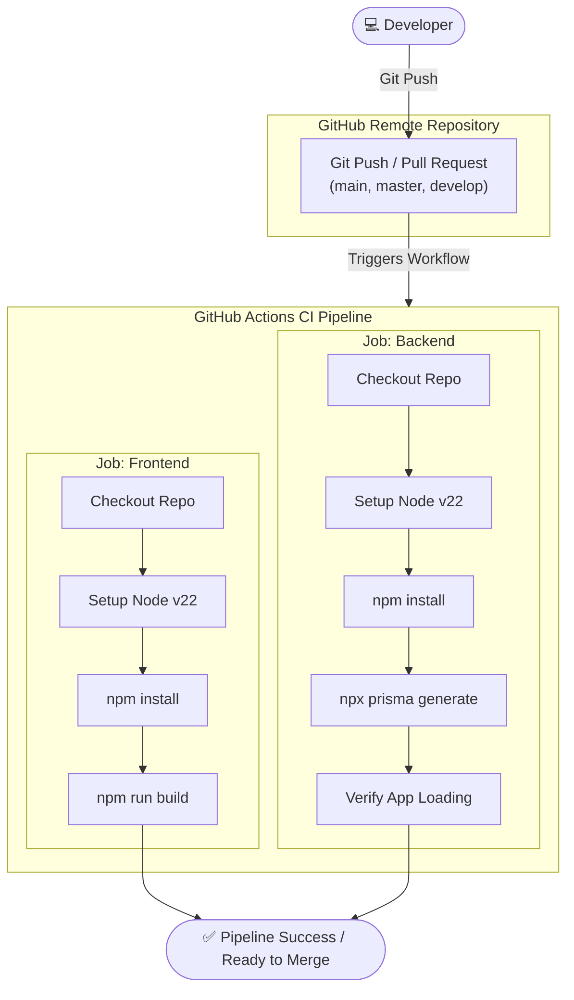

# CI/CD Workflow Explanation

## 1. Overview
Continuous Integration (CI) and Continuous Delivery/Deployment (CD) represent the automation pipelines driving modern software development.
- **Continuous Integration (CI):** The practice of automating the building and testing of code changes every time a developer commits code to version control.
- **Continuous Delivery (CD):** The practice of keeping the codebase in a deployable state, where releases can be automatically pushed to staging or production environments with manual or automated approval.
- **Continuous Deployment (CD):** The practice of automatically deploying every change that passes the CI pipeline to production without human intervention.

**What is implemented in this project:**
This project currently implements **Continuous Integration (CI) ONLY**. 
- It compiles, installs, builds, and validates the codebase on pull requests and pushes.
- It **does not** implement Continuous Delivery or Continuous Deployment (i.e., there is no automated step to push code to a hosting provider like AWS, Vercel, Heroku, or Render).

---

## 2. Workflow Overview
The project uses **GitHub Actions** for CI, defined in `.github/workflows/ci.yml`.

- **Trigger Events:** 
  - `push` to branches: `main`, `master`, and `develop`.
  - `pull_request` targeting branches: `main`, `master`, and `develop`.
- **Jobs:** The pipeline runs two parallel, isolated jobs:
  1. `frontend`
  2. `backend`
- **Execution Order:** Both jobs execute concurrently on separate `ubuntu-latest` GitHub-hosted runners to optimize pipeline execution speed.

---

## 3. Pipeline Stages

### A. Frontend Job Stages
1. **Checkout Repository:** Checks out the codebase using `actions/checkout@v4` so that the runner can access the files.
2. **Setup Node.js:** Sets up Node.js v22 environment using `actions/setup-node@v4`.
3. **Install Frontend Dependencies:** Runs `npm install` inside the `/frontend` directory to install dependencies from `package-lock.json`.
4. **Build Frontend:** Executes `npm run build` to verify that Next.js compilation, TypeScript type checking, and ESLint checks pass successfully.

### B. Backend Job Stages
1. **Checkout Repository:** Retrieves codebase files using `actions/checkout@v4`.
2. **Setup Node.js:** Configures a Node.js v22 runner.
3. **Install Backend Dependencies:** Runs `npm install` inside the `/backend` directory.
4. **Generate Prisma Client:** Executes `npx prisma generate` to build the type-safe Prisma client matching `schema.prisma`.
5. **Verify Backend:** Evaluates the core express app with `node -e "require('./src/app.js'); console.log('Backend OK')"` to verify the application loads and configuration is correct without runtime imports crashing.

---

## 4. Technologies Used

| Technology | Purpose |
|------------|---------|
| **GitHub Actions** | Automation engine orchestrating runner environments and workflows. |
| **Node.js (v22)** | The JavaScript runtime environment executing build scripts and application servers. |
| **npm** | Package manager handling node package dependencies and locks. |
| **Next.js 15 Compiler** | Compiles React components and checks Static Site Generation (SSG) / Server-Side Rendering (SSR) compilation rules. |
| **Prisma CLI** | Generates SQL-compatible query clients based on ORM schema declarations. |

---

## 5. Workflow Diagram

---

## 6. Benefits
- **Early Error Detection:** Broken imports, TypeScript compilation issues, or syntax errors are caught in isolated runners before merging into key branches.
- **Environment Consistency:** Node v22 and Linux environments guarantee compilation behaves exactly the same way as on clean developer systems.
- **Confidence in Merges:** Pull Requests are blocked from merging if builds fail, maintaining master branch stability.

---

## 7. Current Limitations
- **No Automated Testing:** No unit tests (`jest`, `vitest`) or end-to-end tests (`playwright`, `cypress`) are run in the pipeline.
- **No Automatic Deployment (CD):** Successful builds remain in GitHub and are not deployed automatically to Vercel (frontend) or a VPS/Heroku (backend).
- **No Docker Build:** The workflow does not generate Docker images for deployment.

---

## 8. Conclusion
The Continuous Integration setup for the Project Management Platform is at a **functional baseline level**. It guarantees that both the client-side Next.js bundle and server-side Express app compile and resolve their relative package structures successfully. To advance this to production level, unit test validation and continuous deployment pipelines (to Vercel/Render) should be integrated.
